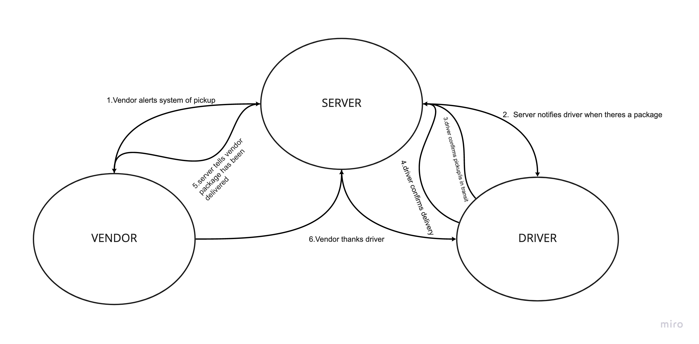

# CAPS

***

## Created by Cameron Walden

***

## Problem Domain

**Phase 1:**

Begin the build of an application for a company called CAPS - The Code Academy Parcel Service. In this sprint, we'llbuild out a system that emulates a real world supply chain. CAPS will simulate a delivery service where vendors (such a flower shops) will ship products using our delivery service and when our drivers deliver them, be notified that their customers received what they purchased.

Tactically, this will be an event driven application that “distributes” the responsibility for logging to separate modules, using only events to trigger logging based on activity.

**Phase 2:**

Change the underlying networking implementation of our CAPS system from using node events to using a library called socket.io so that we can do networked events. Socket.io manages the connection pool for us, makes broadcasting much easier to operate, and works well both on the terminal (between servers) and with web clients

***

## UML 

